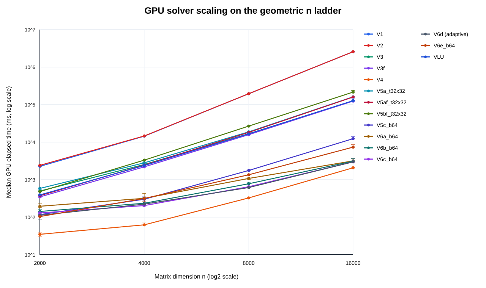
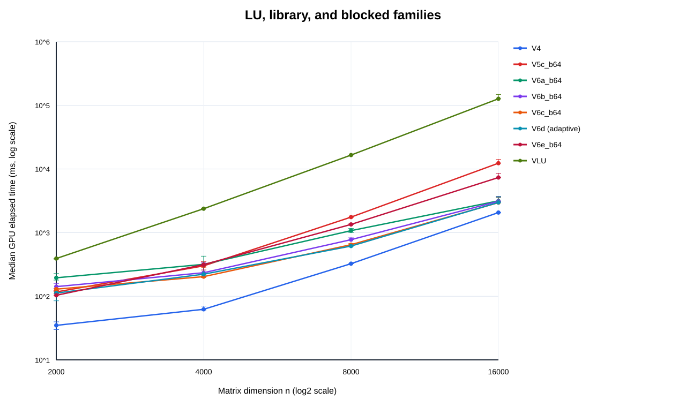
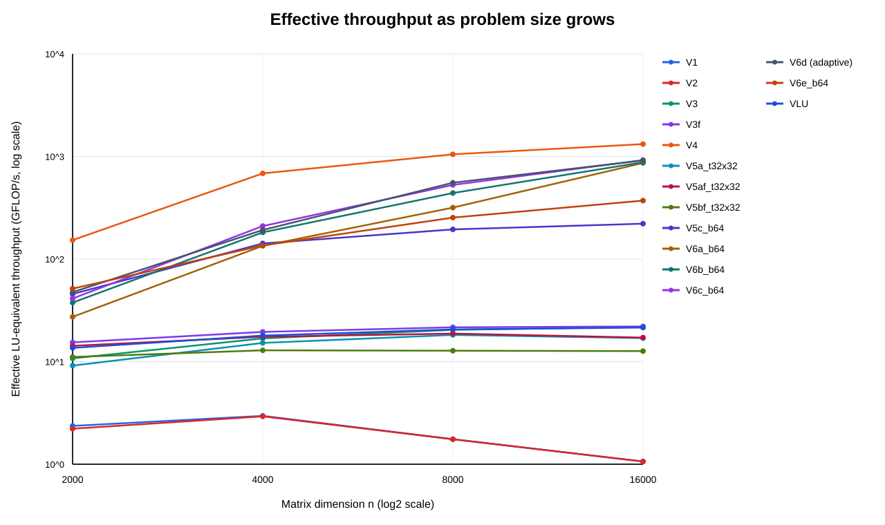
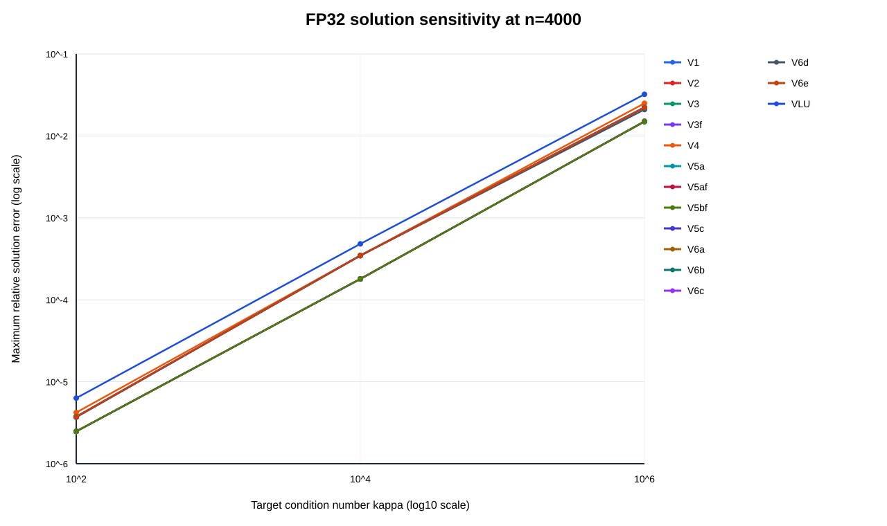
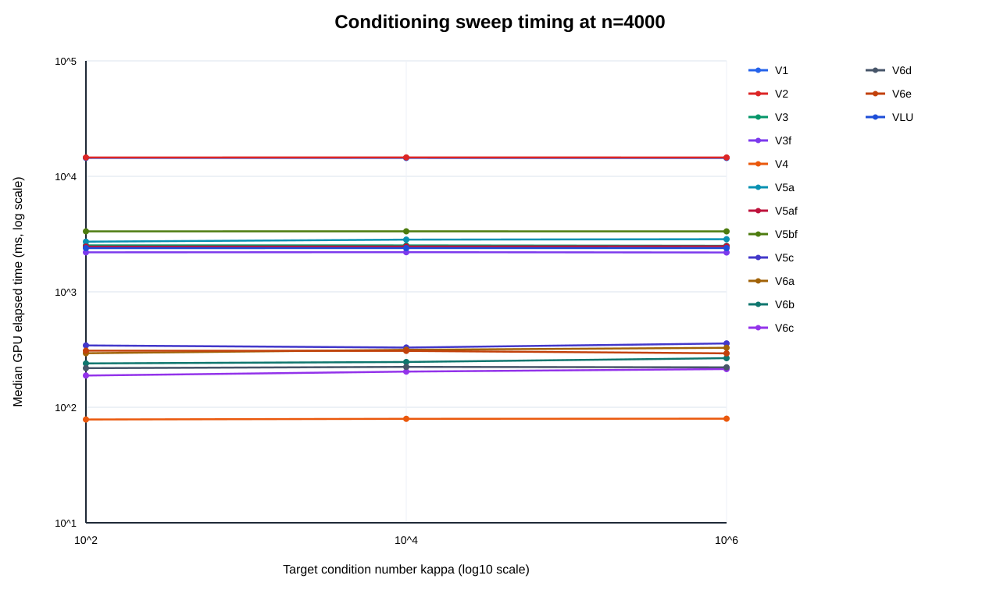
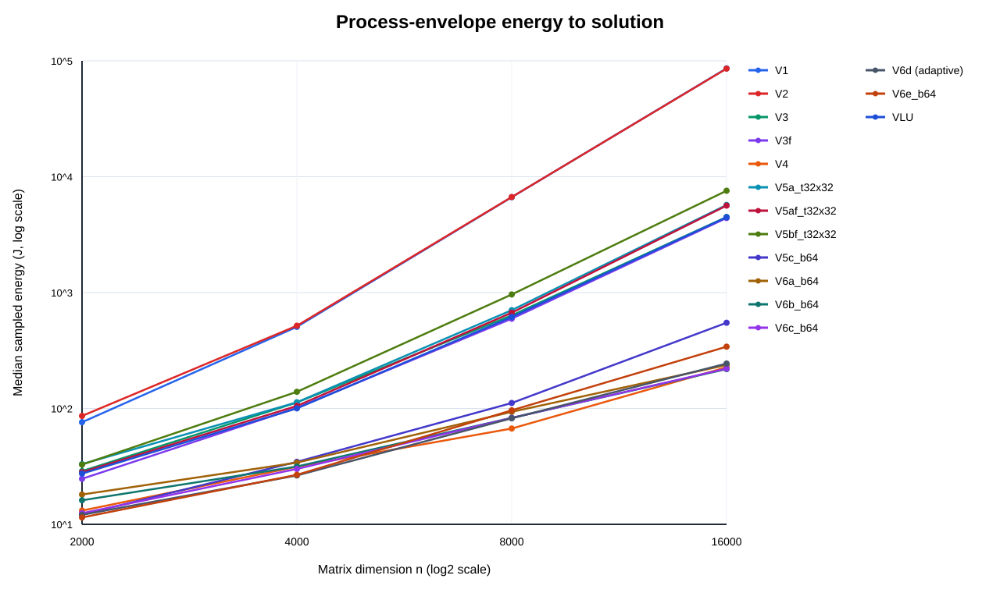

# Geometric Scaling and Conditioning Evidence

**Run dates:** 2026-08-22 to 2026-08-23  
**Hardware:** NVIDIA GeForce GTX 1650, 4096 MiB, compute capability 7.5  
**Software:** CUDA 12.1; Visual Studio 2019 toolchain; commit `e0545d53336fc591c01f8480407fd1d17331730b`

## Research Purpose

This experiment replaces the earlier irregular headline dimensions
(`2000,4096,6000,8000`) with the geometric sequence

\[
n = 1000\times 2^p,\qquad p\in\{1,2,3,4\},
\]

or `n=2000,4000,8000,16000`. Equal problem-size doublings support direct
scaling-exponent estimates, while logarithmic axes keep variants separated by
several orders of magnitude readable in one evidence package.

## Frozen Protocol

| Element | Choice |
|---|---|
| Matrix | Deterministic dense, diagonally dominant FP32 synthetic system with known solution |
| Variants | V1, V2, V3, V3f, V4, V5a, V5af, V5bf, VLU, V6a, V6b, V6c, V6d, V6e, V5c |
| Sizes | `2000,4000,8000,16000` |
| Repeats | One excluded warm-up plus five measured runs per `(variant,n)` cell |
| Ordering | Paired/interleaved; variant launch position rotates by outer repeat |
| Fixed tuning | V5 tile 32x32; fixed blocked variants use panel width 64; V6d selects its panel width |
| Statistics | Median, quartiles, IQR, minimum, maximum |
| Correctness gates | Normalized residual and relative solution error against the known solution |
| Energy | Continuous 200 ms `nvidia-smi` sampling integrated over the benchmark process envelope |

All 60 performance cells completed: 15 variants x 4 sizes x 5 measured
repeats = **300 timed observations**. No measured observation failed the
correctness checks.

## Headline Performance

| n | cuSOLVER V4 median | Fastest custom variant | Custom median | Custom / V4 time |
|---:|---:|---|---:|---:|
| 2,000 | 34.88 ms | V6e, b64 | 103.59 ms | 2.97x |
| 4,000 | 62.36 ms | V6c, b64 | 203.40 ms | 3.26x |
| 8,000 | 325.18 ms | V6d, selected b64 | 615.26 ms | 1.89x |
| 16,000 | 2,068.30 ms | V6c, b64 | 2,962.48 ms | 1.43x |

V4/cuSOLVER remained fastest at every geometric size. The custom blocked-LU
gap nevertheless narrowed from about 3x at `n=2000` to 1.43x at `n=16000`.
This is evidence of improved large-problem utilization, not evidence that the
custom implementation overtook the vendor library.

## Scaling Interpretation

For adjacent doublings, the empirical timing exponent is

\[
p = \log_2\!\left(\frac{T(2n)}{T(n)}\right).
\]

| Variant | 2k to 4k | 4k to 8k | 8k to 16k | Interpretation |
|---|---:|---:|---:|---|
| V3f | 2.66 | 2.85 | 2.97 | Approaches the expected cubic dense-elimination regime |
| V4 | 0.84 | 2.38 | 2.67 | Strong utilization ramp at small n, then trends toward cubic growth |
| V6c | 0.65 | 1.67 | 2.20 | Blocked custom path continues gaining utilization through this range |
| V6e | 1.60 | 2.10 | 2.45 | Improves over rank-1 paths but scales less favorably than V6c at the largest sizes |

The log-log graph reveals both facts: all dense methods ultimately trend toward
cubic work, and vendor/library plus blocked formulations reach useful GPU
utilization much earlier than the kernel-per-pivot rank-1 family.

## Correctness and Conditioning

Across the geometric performance sweep, the maximum normalized residual was
`2.03483e-08` and the maximum relative solution error was `2.07306e-06`.

The conditioned companion sweep used `n=2000,4000`,
`kappa=1e2,1e4,1e6`, all 15 variants, seven interleaved repeats, and one
discarded warm-up. All 90 cells and 630 raw observations completed without a
solver-status or finite-value failure.

| n | Target kappa | Maximum residual | Observed solution-error range |
|---:|---:|---:|---:|
| 2,000 | 1e2 | 1.249e-08 | 2.448e-06 to 8.621e-06 |
| 2,000 | 1e4 | 1.243e-08 | 1.480e-04 to 4.945e-04 |
| 2,000 | 1e6 | 1.255e-08 | 1.109e-02 to 3.538e-02 |
| 4,000 | 1e2 | 1.058e-08 | 1.886e-06 to 6.317e-06 |
| 4,000 | 1e4 | 8.954e-09 | 1.514e-04 to 4.821e-04 |
| 4,000 | 1e6 | 8.504e-09 | 1.413e-02 to 3.219e-02 |

Residuals remain near `1e-8`, but forward solution error grows by roughly two
orders of magnitude for each two-order increase in condition number. This is
the expected FP32 sensitivity pattern: a small backward error does not imply a
small forward error for an ill-conditioned system.

## Energy Boundary

The process-envelope median energy for V4 versus the fastest custom path was
13.14 J versus 11.47 J at `n=2000`, and 226.91 J versus 220.79 J at
`n=16000`. These values include host matrix setup, transfers, validation, and
idle intervals observed by the external sampler. They are suitable as
secondary energy-to-solution evidence, but they must not be described as pure
kernel or solver energy.

## Hardware Limit

`n=16000` is the largest feasible point in the requested geometric sequence on
this 4 GiB GPU. At `n=32000`, the FP32 matrix alone requires 4.096 GB before
the RHS, pivots, status data, factors, and cuSOLVER workspace are allocated.
The stopping point is therefore a declared device-memory boundary rather than
a selectively chosen performance cutoff.

## Dissertation Claims Supported

1. cuSOLVER is the fastest tested solver across the full feasible geometric range.
2. Blocking plus Level-3 BLAS transfers strongly relative to custom rank-1 elimination, while remaining slower than the tuned vendor solver.
3. The custom-to-vendor gap narrows at large n, so conclusions drawn only at `n=2000` understate the value of blocked execution.
4. V6d's adaptive policy selects b32 at `n=2000,4000` and b64 at `n=8000,16000`; it does not consistently beat the best custom fixed-width variant, so adaptation remains a measured design hypothesis rather than a novelty claim.
5. FP32 residuals can remain small while solution error increases materially with condition number; both metrics are required.
6. Consumer hardware can execute dissertation-scale dense cases through `n=16000`, but memory capacity imposes a transparent external-validity boundary.

## Authoritative Artifacts

- `geometric_all_variants_energy_20260822.csv`: raw performance observations.
- `geometric_all_variants_energy_20260822_summary.csv`: performance statistics.
- `geometric_all_variants_energy_20260822_warmup.csv`: excluded warm-ups.
- `geometric_all_variants_energy_20260822_telemetry.csv`: continuous GPU telemetry.
- `geometric_all_variants_energy_20260822_energy.csv`: process-envelope energy integration.
- `geometric_conditioning_all_variants_20260823.csv`: raw conditioned observations.
- `geometric_conditioning_all_variants_20260823_protocol_manifest.csv`: repeat and launch-order traceability.
- `geometric_conditioning_all_variants_20260823_summary.csv`: conditioned statistics.
- `geometric_conditioning_all_variants_20260823_summary.md`: complete human-readable conditioned table.
- `geometric_conditioning_all_variants_20260823_n*_*.svg`: all-variant log-scale timing, residual, and solution-error figures.
